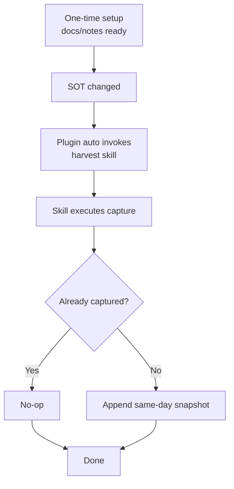

# Harvest Plugin Flowchart Preview (Compact)

This version keeps only the most important decision points.

```mermaid
flowchart TD
  A[One-time setup\ndocs/notes ready] --> B[SOT changed]
  B --> C[Plugin auto invokes\nharvest skill]
  C --> D[Skill executes capture]
  D --> E{Already captured?}
  E -->|Yes| F[No-op]
  E -->|No| G[Append same-day snapshot]
  F --> H[Done]
  G --> H
```
