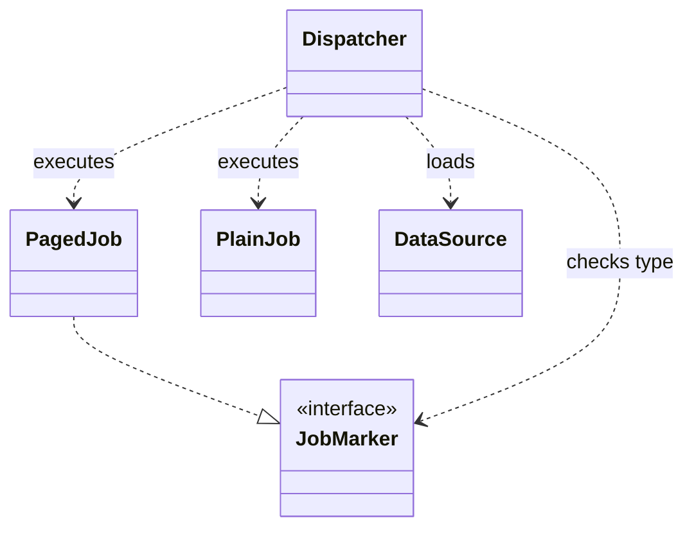
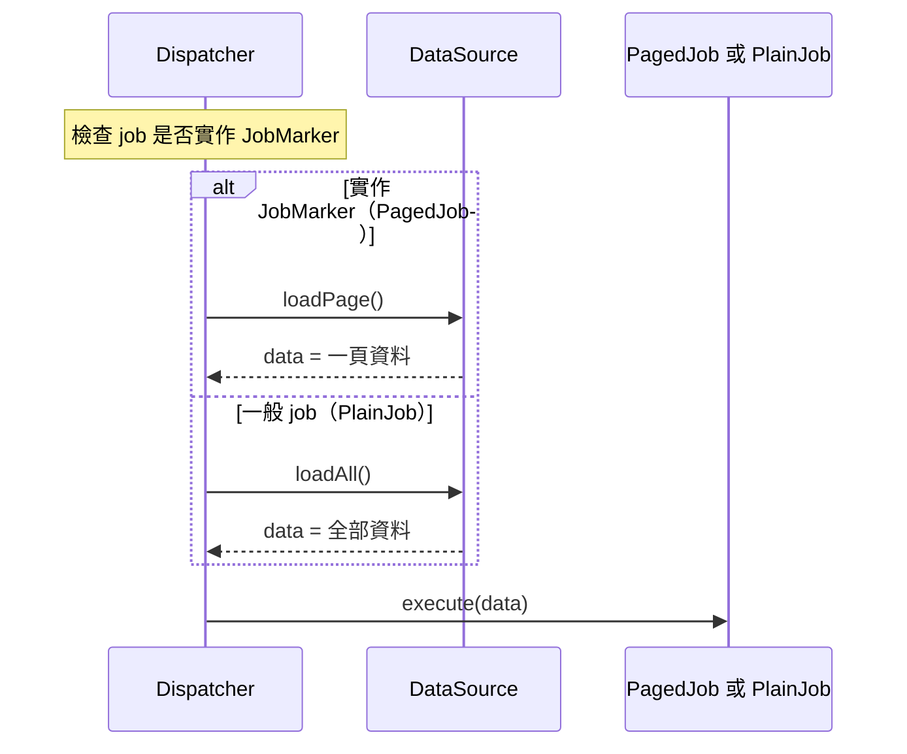

# 局部程式碼理解與 sequence／class diagram 研究

- 查核日期：2026-09-14（Asia/Taipei）。
- 研究問題：工程師只看到局部宣告時，如何協助他建立可用於判斷實際行為的理解？Sequence diagram 與 class diagram 各能提供什麼幫助？
- 狀態：研究筆記；原先評估 `explain` 的小幅修改，後續作為 [`code-tour`](../../skills/code-tour/) 的設計背景。研究結論不等同於 skill 成效證明。
- 證據範圍：8 篇第一手研究；包含作者對自身實驗的彙整。研究結果、跨情境推論、待驗證設計分開記錄。未進行新的受試者實驗。

## 結論

建議優先補強 **由局部程式追到實際消費者與行為後果**，再依讀者卡住的關係選圖。圖種偏好可以決定呈現方式，但不應代替程式查證，也不應成為每次固定輸出兩張圖的規則。這是綜合下列證據提出的設計判斷，不是研究已測試過的 explain 工作流程。

直接比較圖種的小型實驗，僅發現 class＋sequence 相對 class-only 的理解分數顯著較高；另外兩組比較不顯著。其他研究也出現「正確率改善但未省時」及「模型組較慢」的結果。因此，**沒有足夠證據宣稱某一圖種能普遍讓工程師最快理解程式**。[S3](https://doi.org/10.1109/CSMR.2013.51)、[S5](https://doi.org/10.1109/TSE.2006.59)、[S6](https://doi.org/10.1007/s10270-026-01409-2)

## 有證據的發現

### S1：理解需求會超出眼前的宣告

**Sillito、Murphy、De Volder（2006），Questions Programmers Ask During Software Evolution Tasks。** 第一項研究觀察 9 名研究生配對修改不熟悉的 ArgoUML，當中 6 人有業界經驗；第二項觀察 16 名業界程式設計師處理自己的維護任務。作者歸納 44 類提問，涵蓋初始焦點、沿焦點探索、建立相連資訊模型與跨模型推理。這是質性觀察，沒有比較解說格式或測量哪一教學次序最快。[作者原稿，§2–3](https://www.cs.ubc.ca/~murphy/papers/other/asking-answering-fse06.pdf)；[DOI](https://doi.org/10.1145/1181775.1181779)

**可支持的範圍**：找出型別或方法只是部分工作；呼叫、參照、資料來源及相連行為本身都是實際工作中的資訊需求。**限制**：44 類問題不是要求逐題回答的清單，也不是所有讀者必須依序經過的四階段教案。[同一作者原稿，§3–4](https://www.cs.ubc.ca/~murphy/papers/other/asking-answering-fse06.pdf)

### S2：讀懂程序結構，不保證已理解功能目的

**Pennington（1987），Stimulus Structures and Mental Representations in Expert Comprehension of Computer Programs。** 第一個實驗讓 80 名專業程式設計師理解、辨認短程式；第二個讓 40 名專業程式設計師研讀並修改中等長度程式。結果較支持早期表徵以程序／控制流程為基礎；後續主導理解的關係受任務目標影響。[原始出版頁與摘要](https://www.sciencedirect.com/science/article/pii/0010028587900077)；[DOI](https://doi.org/10.1016/0010-0285(87)90007-7)

**可支持的範圍**：控制流程與功能目的不能視為同一種理解；了解每步怎麼執行，不等於自動知道整段在解決什麼問題。**限制**：這不是現代 Java、多模組框架或 LLM 解說實驗，尤其不能據此宣稱「purpose first」的教學順序已經由這篇研究證明。[原始出版頁](https://www.sciencedirect.com/science/article/pii/0010028587900077)

### S3：有直接的 class／sequence 比較，但不足以選出普遍贏家

**Scanniello、Gravino、Tortora（2013），An Early Investigation on the Contribution of Class and Sequence Diagrams in Source Code Comprehension。** 24 名大二資工學生隨機分成三組，取得同一 Music Shop 系統的紙本 Java code，以及 class-only、sequence-only 或兩者合用的設計圖；回答同一份 15 題選擇題，任務設計為一小時內可完成。[作者上傳全文，§III](https://www.researchgate.net/publication/261355912_An_Early_Investigation_on_the_Contribution_of_Class_and_Sequence_Diagrams_in_Source_Code_Comprehension)；[DOI](https://doi.org/10.1109/CSMR.2013.51)

| 比較 | 作者報告的理解分數結果 | 可支持的判讀 |
|---|---|---|
| 合用 vs. class-only | 合用較高，p = .017 | 此任務中加入 sequence 的組合優於只給 class。 |
| 合用 vs. sequence-only | p = .205，未顯著 | 沒有證明再加 class 一定改善；也沒有證明兩組等效。 |
| class-only vs. sequence-only | p = .134，未顯著 | 沒有證明 sequence 普遍優於 class。 |

以上數據來自全文 Table II；樣本小、僅一系統、學生與紙本環境，且此比較沒有 code-only 組。因此不能用它證明「有圖一定優於沒圖」或「兩張圖最快」。[作者全文，§III–V、Table II](https://www.researchgate.net/publication/261355912_An_Early_Investigation_on_the_Contribution_of_Class_and_Sequence_Diagrams_in_Source_Code_Comprehension)

### S4：圖與實作之間的距離，比「有沒有 UML」更值得注意

**Scanniello 等（2018），Do Software Models Based on the UML Aid in Source-Code Comprehensibility? Aggregating Evidence from 12 Controlled Experiments。** 作者彙整自身 12 項實驗，共 333 筆 observations；包含學士、碩士、博士生及義大利、西班牙實務者。比較無註解 Java code 搭配或不搭配 UML，並區分 analysis models、design models，測量理解正確性、時間及兩者比率。[作者機構全文，摘要、§4、Table 2](https://alarcos.esi.uclm.es/ALARNET2/FILES/Articulos/2018-Empir%20Software%20Eng-Scanniello.pdf)；[DOI](https://doi.org/10.1007/s10664-017-9591-4)

彙整結果支持 design models 有助理解；analysis models 可能降低理解並增加時間。作者把 design models 更貼近實作視為可能解釋。**限制**：這不是隔離「同名標籤」的實驗，也不是 12 次獨立重現 class 對 sequence 的比較；不同實驗的模型、系統、族群與任務存在異質性。更不能把「分析圖在特定 code-reading 任務沒有幫助」推成「業務目的不值得解釋」。[同一全文，摘要、§5.2–5.4](https://alarcos.esi.uclm.es/ALARNET2/FILES/Articulos/2018-Empir%20Software%20Eng-Scanniello.pdf)

### S5：較正確與較快是兩個結果

**Arisholm、Briand、Hove、Labiche（2006），The Impact of UML Documentation on Software Maintenance: An Experimental Evaluation。** 在 Oslo、Ottawa 以受過物件導向與 UML 訓練的大學生進行維護實驗，系統是 ATM 與熱飲販賣機。比較有／無 UML 文件；有文件的條件亦須維護圖，衡量修改時間、功能正確性與設計品質。[原始全文，§3](https://www.researchgate.net/publication/3188570_The_impact_of_UML_documentation_on_software_maintenance_an_experimental_evaluation)；[DOI](https://doi.org/10.1109/TSE.2006.59)

複雜任務在一定學習後，有 UML 的條件可改善功能正確性與設計品質，但沒有呈現省時的整體優勢；簡單任務的 UML 更新成本可能相對可觀。**限制**：研究包含實際修改與文件維護，沒有隔離 class 或 sequence 的貢獻，也不能把維護總工時直接換成閱讀一則解說的時間。[作者機構摘要](https://pure.ul.ie/en/publications/the-impact-of-uml-documentation-on-software-maintenance-an-experi/)

### S6：近期研究也沒有得到「模型一定更快」

**Reinhartz-Berger、Snoeck（2026），Software Comprehension in Code-Centric and Model-Driven Settings: An Experimental Comparison of Models and Code。** 本筆記僅採第一個實驗：分析 46 名大三學生，完成 18 個結構／行為問題；比較 Java code 與逆向整理的 class＋sequence models。分組依自報 programming／modeling 背景，**並非隨機分派**。[出版全文，§3.2–3.5](https://link.springer.com/article/10.1007/s10270-026-01409-2)

兩組 correctness 沒有顯著差異；模型組在行為問題用時顯著較長。**限制**：不能把不顯著當成等效；受試者是學生、系統小、行為問題聚焦單一 class，且條件是 model-only 對 code-only，並非比較「相同解說＋有／無圖」。作者對 AI 工具的延伸討論也不是 LLM 成效實驗。[出版全文，§4.1、§5.2、§5.6](https://link.springer.com/article/10.1007/s10270-026-01409-2)

### S7：靠近的圖文可能有助整合，但這是跨領域證據

**Moreno、Mayer（1999），Cognitive Principles of Multimedia Learning: The Role of Modality and Contiguity。** 在第一個實驗中，氣象知識較少的大學生觀看閃電形成動畫，隨機接受鄰近文字、分離文字或語音。作者以保留、遷移及配對題測量學習，發現圖文鄰近的學習優勢。[作者上傳原稿，Experiment 1](https://www.researchgate.net/profile/Richard-Mayer-4/publication/228698670_Cognitive_Principles_of_Multimedia_Learning_The_Role_of_Modality_and_Contiguity/links/57799c7608aead7ba0764344/Cognitive-Principles-of-Multimedia-Learning-The-Role-of-Modality-and-Contiguity.pdf)；[DOI](https://doi.org/10.1037/0022-0663.91.2.358)

**可支持的範圍**：圖文位置能影響這類教學的效果。**限制**：不是熟悉領域的資深工程師、互動 IDE 或聊天中的靜態 UML；「把條件註解放在對應箭頭旁」只能是值得驗證的移用。本文沒有測試 `file:line`、跨檔跳轉成本或 LLM 生成圖。

### S8：喜歡某種圖，與用它答對題目，必須分開

**Purchase、Allder、Carrington（2002），Graph Layout Aesthetics in UML Diagrams: User Preferences。** 70 名學生參加 class 圖評估，90 名參加 collaboration 圖評估；對成對 layout 選擇偏好並說明原因。研究產生美學優先順序，但測的是偏好，並非理解正確率或速度。[期刊原文，§2.4–3](https://ftp.gwdg.de/pub/misc/EMIS/journals/JGAA/accepted/02/PurchaseAllderCarrington02.6.3.pdf)；[DOI](https://doi.org/10.7155/jgaa.00054)

**限制**：collaboration diagram 不是 sequence diagram；這篇不能拿來證明使用者偏好的 class／sequence 圖更有效，也不能推出固定節點上限。其用途是提醒 eval 把「喜歡」與「理解表現」分開計分。[作者機構摘要](https://research.monash.edu/en/publications/graph-layout-aesthetics-in-uml-diagrams-user-preferences/)

## 推論與適用限制

以下是綜合判斷，並非上述研究直接驗證的工作流程。

| 讀者尚未建立的關係 | 可嘗試的解說與圖 | 不能由圖代答的事 |
|---|---|---|
| 這個宣告在系統中有何作用 | 先指出實際消費者、觸發點及可觀察後果；必要時以小型 class 圖連起相關型別與依賴。 | 名稱、空介面或繼承線無法自行證明 runtime 行為。 |
| 誰先呼叫誰、條件在哪裡分支 | 用一個具體情境的 sequence 圖，對齊參與者、呼叫及關鍵條件。 | 單一路徑不代表所有路徑；沒畫到不代表不可能執行。 |
| 為何相同入口產生不同結果 | 對照兩個最小輸入／條件，標出第一個分歧及後果；可放在同一圖的分支。 | 不應為了完整而虛構另一條未查證路徑。 |
| 狀態、資料或交易在哪裡改變 | 在相應步驟旁交代前後值、寫入或邊界；必要時回看實作與框架設定。 | 呼叫順序本身不能證明 commit、rollback、隔離程度或持久化結果。 |

OMG UML 2.5.1 的 Annex A（Figure A.5 及其說明）區分結構圖的靜態關係與行為圖隨時間變化的行為。§17.1.1 說明 interaction 通常不涵蓋所有合法 trace，著重訊息交換，資料操弄不是焦點；§17.8 的 sequence notation 著重 lifeline 間的訊息次序。因此，「圖中未出現」不能當成「程式中不可能」，資料載入與狀態結果也需要另外說明。[OMG UML 2.5.1，Annex A、§17.1.1、§17.8](https://www.omg.org/spec/UML/2.5.1/PDF)

同一規範的 §10.4.3 將 interface 定義為契約，並不指定如何實作；具體標記的 runtime 效果仍須由消費者程式查證。這些是 **表示語意的規範依據，不是理解效果實驗**。[OMG UML 2.5.1，§10.4.3](https://www.omg.org/spec/UML/2.5.1/PDF)

Mermaid 官方文件分別列出 sequence 的 `alt`／`opt`／notes 與 class 的 realization／dependency，可用來避免把「實作標記」和「依賴／檢查標記」混成同一種線；這些是工具的表達能力，也不是理解效果證據。[Mermaid sequence](https://mermaid.js.org/syntax/sequenceDiagram.html#alt)、[Mermaid class relationships](https://mermaid.js.org/syntax/classDiagram.html#defining-relationship)

本次沒有取得足以指定「最多幾個節點／幾條訊息」的工程師閱讀實證，也沒有取得直接比較「LLM 先給真實 trace」與「先講 pattern」的因果實驗。因此，選取少量相關資訊、顯示具體 trace 與漸進補圖都應視為設計假說，不能套用任意認知容量數字作為硬性上限。

### 合成示例：同一機制的兩個視角

**以下完全是合成示例，並非原專案實況或 marker 的通用保證。** 假設空介面 `JobMarker` 由 `PagedJob` 實作；`PlainJob` 未實作。載入方式由虛構的 `Dispatcher` 型別檢查決定，與交易語意無關。

Class 圖回答「誰實作標記、誰檢查它、誰負責載入」。Sequence 圖的 `job` 則是 `PagedJob` 或 `PlainJob` 的實例，沿用相同型別名稱，補上這一次呼叫的分支與次序。

此 sequence 圖回答「何時選哪種載入、先載入再執行、這次收到多少資料」。Class 的 realization 線本身不包含這項策略；效果來自本示例明定的 `Dispatcher` 行為。兩圖放在一起只是示範互補，不代表每次解說都需要雙圖。

## 先前對 explain 的候選設計

研究時檢視的通用 `explain` skill 已有 purpose first、實際 code、位置證據、推論標示、真實 input trace 與依理解落差調整。本次候選應補充 **何時需要把探索範圍擴到消費者**，避免重複新增一套固定解說章節。

1. **把局部宣告當起點。** 若宣告本身不足以回答「它有什麼作用」，沿實際 references 找出會解讀它的程式，再向前確認如何進入、向後確認造成什麼結果。查到一條足以回答問題的證據鏈後，依問題決定是否擴張。
2. **先讓讀者能預測一個結果。** 第一輪用短文交代「在什麼條件下，誰根據這個宣告改變了什麼行為」。Pattern 名稱可以幫助命名，效果仍要由此系統的程式證明。
3. **按理解落差選圖。** 角色與型別關係不清時先試 class；時序、跨模組接力或分支不清時先試 sequence。只有第二張圖能補足第一張缺少的關係時才加上。
4. **讓圖容易對回程式。** 沿用實際名稱；條件、資料變化與關鍵副作用標在對應步驟旁，附近附來源位置。明示圖是特定情境、靜態推演或實測 trace，並標出省略範圍。
5. **用可預測性檢查理解。** 依對話需要，確認讀者能解釋另一個最小情境；不必每次考問使用者。理解仍不足時，修補缺少的因果關係，而非只改用更多術語。
6. **區分現況理解與設計建議。** 使用者目前要理解現況時，先完成現況的證據鏈；是否重構另依任務授權處理。

以上六項均為候選；S1–S7 提供動機與限制，沒有直接證明這六項的組合、次序或 LLM 執行成效。較小的可試方案是先補一則跨檔消費者 eval，再決定短規則是否足夠；目前沒有證據要求立即新增 `references/code-walkthrough.md`。

## 原研究提出的驗證方向

使用者回饋的 Gateway／空 Job marker 案例是需求線索；本研究沒有讀取該案例原碼，**不能確認其預載或交易行為**。若建立 fixture，應明示為合成案例，將行為完整寫在可查證的程式及預期答案中。

| 候選案例 | 要辨別的能力 | 主要觀察 |
|---|---|---|
| 局部 marker，真正檢查位於另一模組 | 由宣告追到消費者與兩種行為 | 第一輪是否指出誰檢查、分支條件、具體後果及證據；不可只說 marker pattern。 |
| 相同外觀 marker，實際沒有 runtime 檢查 | 證據不足時限制結論 | 是否避免憑名稱猜預載、交易或框架魔法。 |
| 靜態型別關係已清楚，跨模組分支不清楚 | 按問題選表示 | Sequence 是否補足時序／條件；class 圖是否只在有新增解釋價值時出現。 |
| 多個型別與消費者容易混淆，控制流程簡單 | 補結構而非塞滿時序 | Class 圖是否區分 realization 與 dependency，並保留查證線索。 |
| 同一輸入走不同資料載入／交易路徑 | 解釋可觀察結果 | 能否正確預測兩個情境，指出條件與狀態／副作用；交易主張必須有證據。 |
| 明確只要求先理解現況 | 尊重問題與授權 | 第一輪完成理解所需內容，沒有把重構提案當成答案。 |

**Agent 行為 eval** 可比較現行版本與候選小修改：相同 fixture、問題、模型與工具條件，評估第一輪證據鏈完整性、錯誤主張、無根據圖邊及不必要內容。Astra 的 medium 與 high effort 應分別記錄結果，並保留窄問題與非程式解說作為回歸對照。這只能驗證 agent 是否依期待解釋。

**人類理解 eval** 才能回答「最快建立正確理解」：在等量核心資訊下，比較短文、短文＋sequence、短文＋class，必要時再加兩圖組；依程式／UML 熟悉度與任務分層，使用不同但可比的案例平衡順序。分別量測情境預測正確率、達到正確答案所需時間、跨情境遷移及主觀偏好；避免只以短回答時間或「看起來清楚」當成功。

首輪可先檢驗「是否不用再追問『在哪被使用』就能答對實際行為」，但追問次數仍只是輔助訊號；讀者沒有追問也可能是誤以為自己懂了。以上是原研究提出的驗證方向；後續 agent 實驗的範圍與限制補記如下。人類理解實驗尚未執行。

## 後續實驗與 code-tour 的定位

2026-09-14 曾把精簡規則加入 `explain`，並以 6 個案例、兩個版本、Astra 的 medium／high effort 執行 24 次比較。新舊版本各通過 47／48 項 assertions，沒有觀察到淨改善；兩邊各有一處交易來源行號不精確。案例規模小，部分題目已指定圖種，不能藉此判斷自主選圖能力，更沒有量測人類的理解速度。這批詳細結果留在原私有 repository；此處僅保留設計歷程的彙總，不能當成公開可重現的證據。

該修改最終關閉且未合併。這個結果支持停止擴充重複的通用解說規則，並不代表圖對程式理解沒有用途。

`code-tour` 採用另一個交付目標：由使用者明確啟動，沿著一項功能的實作建立可跟讀的路線，串起具體情境、適合的圖和附閱讀目的的原碼位置。Class 與 sequence 圖依問題選用；不固定要求雙圖，也不要求逐步考問。這是對可重複使用工作流程的設計選擇，尚不能宣稱能提升模型能力或讓人更快理解。

初版曾以一個私有 Java 專案的固定版本做探索性比較：3 個案例、Astra medium／high、有／無 skill，共 12 次執行。有 skill 的版本通過 30／30 項，無 skill 的版本通過 26／30 項；差異集中在精確來源連結與保存文件的版本資訊，兩邊的程式行為判斷都正確。文字流程圖與 Mermaid 均依其表達的關係計分。原始碼、導讀與詳細結果保存在本機私有證據中，不隨此公開 repository 發布；讀者無法只靠此 repo 獨立重現這批結果，因此它僅列為探索紀錄。

正式發布前的 `skill-review --fix` 改用獨立撰寫、可公開散布的合成案例，並把完成條件改為 agent 能核對的導讀交付，避免把「讀者已理解」當成可觀測事實。公開案例與結果放在 [`skills/code-tour/evals/`](../../skills/code-tour/evals/)。兩批使用不同程式與問題，分開報告，不合計或拿分數變化宣稱改版效果；它們也都不代表人類理解速度提升。

公開合成案例的 12 次執行中，有 skill 通過 30／30 項，無 skill 通過 28／30 項；差異僅在保存文件的來源與快照資訊，功能與圖的關係兩邊都正確。Class diagram 案例有明確指定圖種，因此不代表自主選圖能力已被證明。[公開案例的完整結果與限制](../../skills/code-tour/evals/results/2026-09-14-public/README.md)
