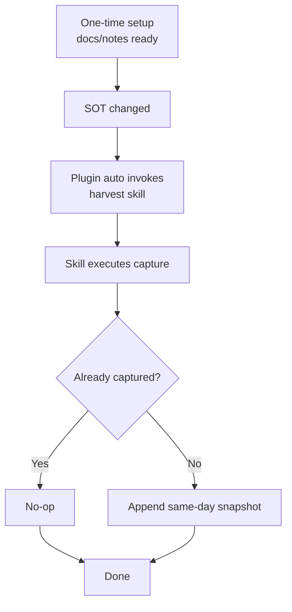

# Harvest - Project Memory for AI + Humans

Turn ongoing work into a durable project second brain.

`harvest` helps AI agents keep planning files as source-of-truth while continuously publishing reusable knowledge into `docs/notes`.

## Why This Skill Exists

Most project context is lost after long sessions:

- Decisions are buried in chat history
- Useful fixes are mixed with execution noise
- Future contributors cannot reconstruct why changes happened

`harvest` solves this by capturing only reusable, traceable knowledge.

## What AI Does for You

When this skill triggers, the agent will:

1. Keep `task_plan.md`, `findings.md`, and `progress.md` as source-of-truth
2. Auto-bootstrap a minimal `docs/notes` structure if missing
3. Publish milestone and snapshot notes in Obsidian-compatible Markdown
4. Enforce traceability (`source_files`, `source_date`, `source_ref`)
5. Avoid recursive or noisy summaries

## Trigger Phrases

Use phrases like:

- `harvest`
- `/harvest`
- `harvest this`
- `harvest this conversation`
- `save this to second brain`
- `save what we just did`
- `document this work`
- `capture this knowledge`

## Output Model

Source-of-truth input:

- `task_plan.md`
- `findings.md`
- `progress.md`

Second-brain output:

- `docs/notes/index.md`
- `docs/notes/projects.md`
- `docs/notes/decisions.md`
- `docs/notes/knowledge.md`
- timeline, decision, and knowledge notes under `docs/notes/...`

## First-Run Behavior

On first run (or when files are missing), the skill creates a minimal structure from its internal bootstrap templates:

- hub notes (`index`, `projects`, `decisions`, `knowledge`)
- timeline template
- decision template
- knowledge template

Existing user files are never overwritten during bootstrap.

## Safety Rules

`harvest` intentionally excludes:

- tool chatter and operation traces
- scaffolding placeholders
- unresolved draft fragments without conclusions
- recursive summaries of `docs/notes` itself

It also supports explicit exclusion markers inside source-of-truth files:

- `<!-- harvest:exclude:start -->`
- `<!-- harvest:exclude:end -->`

## Commands

This repository also provides command wrappers:

- `commands/harvest.md`
- `commands/harvest-start.md`
- `commands/harvest-status.md`
- `commands/harvest-capture.md`
- `commands/harvest-audit.md`

Use these for quick operational entrypoints and manual control.

## Plugins

`harvest` also supports an optional OpenCode plugin for automatic capture.

Recommended setup:

1. Run one manual `harvest` (or `/harvest-start`) first to initialize `docs/notes`.
2. Enable plugin auto-capture for daily usage.

- Plugin file: `.opencode/plugins/harvest.js`
- Install guide: `../../.opencode/INSTALL.md`
- Trigger source: SOT changes in `task_plan.md`, `findings.md`, `progress.md`
- Convergence: run again on `session.idle` when pending

Simple flow:

Notes:

- Plugin is optional. You can run `harvest` manually without it.
- With plugin enabled, repeated SOT updates are captured automatically for better day-to-day flow.

## Example Workflow

1. Work normally with planning files
2. Run `harvest this` at a meaningful checkpoint
3. Agent appends a timeline snapshot with `when/change/why/source_ref`
4. At milestones, agent promotes stable insights into decisions/knowledge notes

## How to Start

1. Install this skill from this repository
2. In any project, ask your agent:
   - `harvest`
   - or `save this to second brain`
3. Review generated notes under `docs/notes`

## Related Files

- [SKILL.md](SKILL.md) - agent execution contract
- [../../.opencode/INSTALL.md](../../.opencode/INSTALL.md) - OpenCode auto-capture plugin install guide
- [references/bootstrap/index.md](references/bootstrap/index.md) - default second-brain index template
- [references/bootstrap/projects/_template/timeline-template.md](references/bootstrap/projects/_template/timeline-template.md)
- [references/bootstrap/decisions/decision-template.md](references/bootstrap/decisions/decision-template.md)
- [references/bootstrap/knowledge/knowledge-template.md](references/bootstrap/knowledge/knowledge-template.md)

## License

MIT
