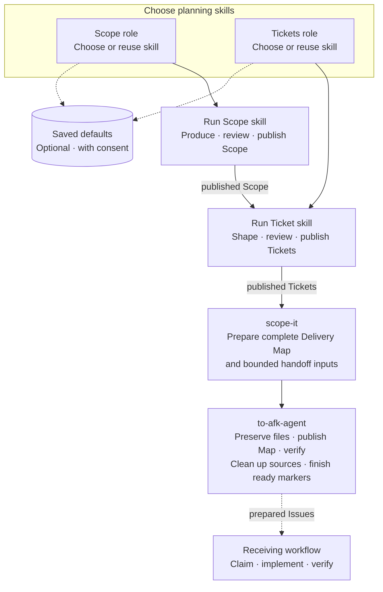

# scope-it

Coordinate interchangeable scope and ticket workflows into one Delivery Map and a verified AFK handoff.

This skill must be invoked explicitly. Its handoff requires the `to-afk-agent` skill and GitHub access.

Use `--publish` to complete the agreed planning and AFK preparation without routine confirmation between steps:

```text
$scope-it --publish
```

## Workflow



Scope and Tickets roles are chosen independently; remembering either choice is optional and requires consent. AFK preparation is the default endpoint. The receiving workflow owns dispatch, claims and implementation.

The selected planning skills own their content, reviews and publication. Scope is published first, then passed to the Tickets skill, with new ready markers deferred until handoff completes. `scope-it` prepares the Map and gives `to-afk-agent` its full content, destination, permitted reference substitutions and any required file or worktree work. The handoff skill preserves artifacts, publishes and verifies the Map, completes cleanup, then adds missing ready markers.

Publication keeps the agreed placement: an existing parent hosts Scope without replacing the report, one Ticket uses that parent as its identity, and multiple Tickets become children. The Map is one canonical parent comment. A Ticket can receive a link to that comment when execution context is missing; the full Map stays on the parent.

The Map is a compact delivery index with its own selection protocol. A later session can start from the parent to choose one live Ticket before loading its details. Requirements and acceptance remain complete in Scope and Tickets.

Choose scope and ticket skills independently, by name or with `--scope-skill <skill>` / `--ticket-skill <skill>`. Confirmed defaults can be remembered across repositories; older saved choices need consent before becoming reusable planning delegations. Publication and planning-file writes remain subject to the current approval.

## Planning skill examples

| Collection | Scope | Planning / ticket content |
| --- | --- | --- |
| Matt Pocock | `to-spec` | `to-tickets` |
| [Superpowers 6.2.0](https://github.com/obra/superpowers/tree/v6.2.0/skills) | `brainstorming` | `writing-plans` |
| [Addy Osmani](https://github.com/addyosmani/agent-skills/tree/7cb7a20bb38b199728d456999c725a0488490ab6/skills) | `spec-driven-development` | `planning-and-task-breakdown` |

These are optional planning sources. An implementation plan still needs a compatible skill to shape delivery tickets. `to-afk-agent` is the fixed handoff dependency and follows the current workflow authority; it is independent of the two saved planning-role choices.

Planning files such as ADRs or `CONTEXT.md` changes travel as exact patches in Planning Carry, with a responsible Ticket and landing path. `scope-it` establishes the content and delivery obligations; `to-afk-agent` performs remote preservation and fills the Map's agreed version references.

After remote preservation and Map publication are verified, the default is **Clean up local source** for the selected content; explicitly request **Retain local source** to keep it. Unrelated, changed or uncertain content is preserved. Eligible temporary planning worktrees are explicitly handed over for cleanup, including those created by the selected planning skills. Existing worktrees and explicit retention choices are respected.

Preview requests stay read-only. If GitHub placement or the handoff dependency is unavailable, planning drafts can be retained, but AFK handoff remains incomplete. Retrieving an existing Map does not restart preparation. Shared integration delivery remains optional and follows the repository's execution workflow.

## Installation

```bash
npx skills add shihyuho/skills --skill scope-it -g
```
