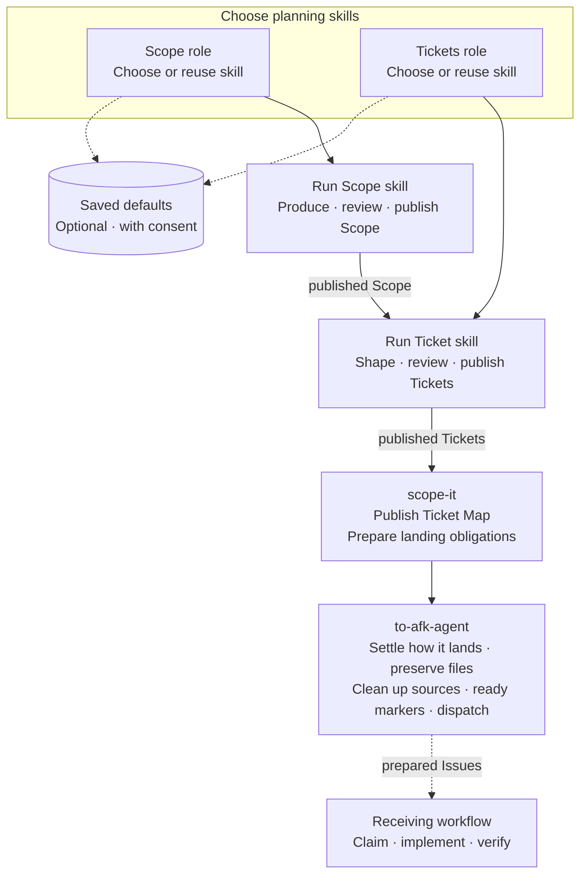

# scope-it

Coordinate interchangeable scope and ticket workflows into a Ticket Map and a verified AFK handoff.

This skill must be invoked explicitly. Its handoff requires the `to-afk-agent` skill and GitHub access.

Use `--publish` to complete the agreed planning and AFK preparation without routine confirmation between steps:

```text
$scope-it --publish
```

## Workflow


```mermaid
flowchart TD
    subgraph CHOOSE["Choose planning skills"]
        direction LR
        CS["Scope role<br/>Choose or reuse skill"]
        CT["Tickets role<br/>Choose or reuse skill"]
    end

    SAVE[("Saved defaults<br/>Optional · with consent")]
    S["Run Scope skill<br/>Produce · review · publish Scope"]
    T["Run Ticket skill<br/>Shape · review · publish Tickets"]
    M["scope-it<br/>Publish Ticket Map<br/>Prepare landing obligations"]
    H["to-afk-agent<br/>Settle how it lands · preserve files<br/>Clean up sources · ready markers · dispatch"]
    E["Receiving workflow<br/>Claim · implement · verify"]

    CS -.-> SAVE
    CT -.-> SAVE
    CS --> S
    CT --> T
    S -->|"published Scope"| T
    T -->|"published Tickets"| M
    M --> H
    H -. "prepared Issues" .-> E
```

Scope and Tickets roles are chosen independently; remembering either choice is optional and requires consent. AFK preparation, ending with any agreed dispatch by `to-afk-agent`, is the default endpoint. The receiving workflow owns claims and implementation.

The selected planning skills own their content, reviews and publication. Scope is published first, then passed to the Tickets skill, with new ready markers deferred until handoff completes. `scope-it` publishes the Ticket Map, then gives `to-afk-agent` the Issues, landing obligations and any required file or worktree work. The handoff skill decides how the work lands, preserves artifacts, completes cleanup, then adds missing ready markers.

Publication keeps the agreed placement: an existing parent hosts Scope without replacing the report, one Ticket uses that parent as its identity, and multiple Tickets become children.

With two or more Tickets, the Ticket Map is one parent comment that shows people, at a glance, how the Tickets depend on each other, in the smallest view that makes the shape clear. Agents read the native blockers, and the receiving workflow chooses what to start. Requirements and acceptance remain complete in Scope and Tickets.

Choose scope and ticket skills independently, by name or with `--scope-skill <skill>` / `--ticket-skill <skill>`. Confirmed defaults can be remembered across repositories; older saved choices need consent before becoming reusable planning delegations. Publication and planning-file writes remain subject to the current approval.

## Planning skill examples

| Collection | Scope | Planning / ticket content |
| --- | --- | --- |
| Matt Pocock | `to-spec` | `to-tickets` |
| [Superpowers 6.2.0](https://github.com/obra/superpowers/tree/v6.2.0/skills) | `brainstorming` | `writing-plans` |
| [Addy Osmani](https://github.com/addyosmani/agent-skills/tree/7cb7a20bb38b199728d456999c725a0488490ab6/skills) | `spec-driven-development` | `planning-and-task-breakdown` |

These are optional planning sources. An implementation plan still needs a compatible skill to shape delivery tickets. `to-afk-agent` is the fixed handoff dependency and follows the current workflow authority; it is independent of the two saved planning-role choices.

Planning files such as ADRs or `CONTEXT.md` changes travel as exact patches in Planning Carry. `scope-it` establishes the content and its landing target; `to-afk-agent` decides how it lands, including the delivery mode and Carrier, performs remote preservation and records the Carry.

After remote preservation is verified, the default is **Clean up local source** for the selected content; explicitly request **Retain local source** to keep it. Unrelated, changed or uncertain content is preserved. Eligible temporary planning worktrees are explicitly handed over for cleanup, including those created by the selected planning skills. Existing worktrees and explicit retention choices are respected.

Preview requests stay read-only. If GitHub placement or the handoff dependency is unavailable, planning drafts can be retained, but AFK handoff remains incomplete. Retrieving an existing Map does not restart preparation.

## Installation

```bash
npx skills add shihyuho/skills --skill scope-it -g
```
